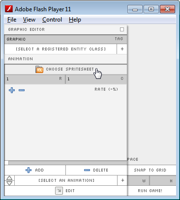
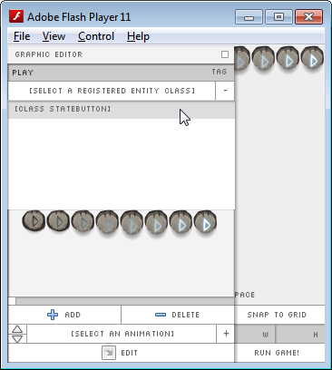
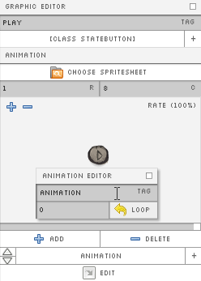
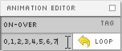
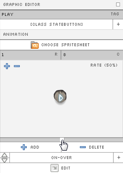
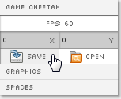
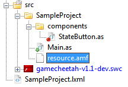

#Building Your First Entity
To begin writing logic that controls your button or your hero we need to link *Entity* classes to their graphical counterparts in the UI. (This is similar to linkages in Flash CS5, if you're familiar with that concept.)

###Creating a Button Class
1. Create a new AS3 file *components/StateButton.as*:

        package SampleProject.components
        {
            import gamecheetah.Entity;

            public class StateButton extends Entity 
            {
            }
        }

2. In your *Main.as* add the following code:

        package SampleProject
        {
            import gamecheetah.Engine;
            import SampleProject.components.StateButton;

            public class Main extends Engine 
            {
                public function Main() 
                {
                    super(60);  // Launch game at 60 fps
                }

                override public function onEnter():void 
                {
                    Engine.registerEntity(StateButton);
                }
            }
        }
This tells the library that you want to use this class in the designer UI.

###Creating the Button Graphic
3. Run your project and go into the designer UI. Under the topleft **_Graphic_** menu click **_Add_**. Next, select the Graphic from the drop down and click **_Edit_**. This should bring up:

    
    
4. Click **_Choose Spritesheet_** and pick a sprite sheet for your button.
5. Lets name our button: "play". Any _**Graphic Tag** you enter will be automatically be converted to lowercase_ for consistency (and partly because the designer-font only has uppercase).
6. Now, let's link our _StateButton_ class to our "play" _Graphic_. Click on the drop-down and select the class we just registered:

    
    
7. Depending on the spritesheet used, set the number of rows and columns in the fields labelled _**R**_ and _**C**_.

###Animating your Graphic
8. Notice the bottom menu buttons, click **_Add_** to add an animation. Use the drop-down to select the newly created _Animation_. After selecting the animation, click **_Edit_** and a pop-up dialog should appear:

    
    
9. Specify the name of the animation, and the sequence of frames you wish to play separated by commas. Click _**Loop**_ to toggle animation looping.

    
    
10. Your animation will probably play too fast at 60 fps. To slow it down, click and drag the slider above the _**Add**_ and _**Delete**_ buttons (Note: you can set a frame-rate per animation):

    
    
###Saving and Loading your Resources
1. In the top left menu select _**Game Cheetah**_. Click on _**Save**_ and choose a location to save your current data.
    
    

2. For convenience, add the following to *Main.as* to automatically load your resources everytime you run your project:
        package SampleProject
        {
            import gamecheetah.Engine;
            import SampleProject.components.StateButton;

            public class Main extends Engine 
            {
                // Embed assets to automatically load resources on building SWF.
                [Embed(source = "resource.amf", mimeType = "application/octet-stream")]
                private static var Assets:Class;

                public function Main() 
                {
                    super(60);  // Launch game at 60 fps
                }

                override public function onEnter():void 
                {
                    Engine.registerEntity(StateButton);

                    // Load resource file. MUST be AFTER registerEntity()!
                    Engine.loadEmbeddedFile(Assets);
                }
            }
        }
3. The source path depends on where you saved your data. In this example, the _.amf_ file is saved under *src/SampleProject*:

    