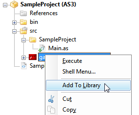
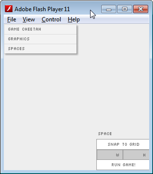

#Set-up
If you not familiar with FlashDevelop already, it's a free full-featured code editor that can be used for AS3 projects. Unfortunately it's only officially supported for all versions of Windows. Alternatively, FlashBuilder can be used, although I've never used it.

### Installing FlashDevelop
1. Install [FlashDevelop](http://www.flashdevelop.org) and create a new *AS3 project* under the menu **_Project_ > _New Project..._ : _AS3 Project_**.
2. Install an SDK which supports compilation of FlashPlayer 11.9+. This step should be unnecessary if the latest version of FlashDevelop is installed. Otherwise check [this tutorial](https://francescomaisto.wordpress.com/blog/tutorial-how-to-change-air-sdk-in-flashdevelop) on changing SDK versions.
3. Go to **_Project > Properties..._** to make sure Flash Player 11.9+ is selected.

### Linking the Developer Library 
4. Download the latest [developer swc](http://www.gamecheetah.net).
5. Link the swc library:

    

### Setting up the Document Class
6. Replace *Main.as* with something like:
    
        package SampleProject
        {
            import gamecheetah.Engine;

            public class Main extends Engine 
            {
                public function Main() 
                {
                    super(60);  // Launch game at 60 fps
                }
            }
        }

7. Run the project (**F5**) and you should get this window:

    
    
8. You're done! Now we're ready to start building your game...
